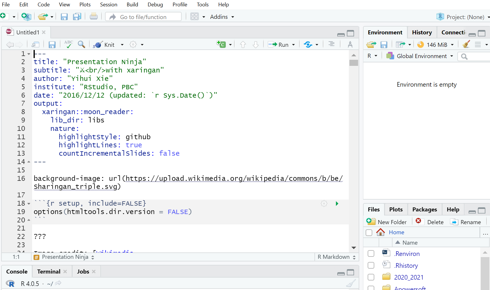
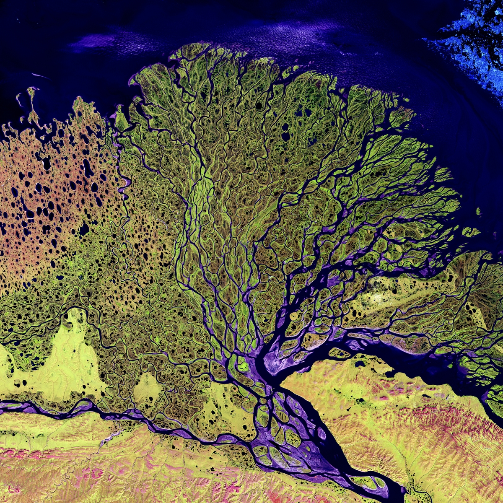
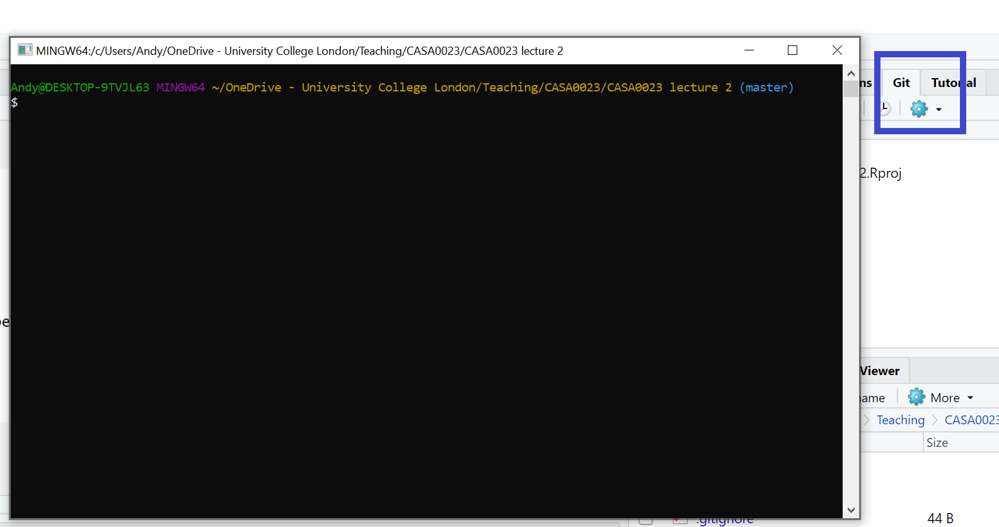

```{r setup, include=FALSE}
options(htmltools.dir.version = FALSE)
```

```{r xaringan-all, echo=FALSE}
library(countdown)
library(xaringan)
library(xaringanExtra)
library(knitr)

hook_source <- knitr::knit_hooks$get('source')
knitr::knit_hooks$set(source = function(x, options) {
  x <- stringr::str_replace(x, "^[[:blank:]]?([^*].+?)[[:blank:]]*#<<[[:blank:]]*$", "*\\1")
  hook_source(x, options)
})

xaringanExtra::use_broadcast()
xaringanExtra::use_freezeframe()
xaringanExtra::use_scribble()
#xaringanExtra::use_slide_tone()
xaringanExtra::use_search(show_icon = TRUE)
xaringanExtra::use_freezeframe()
xaringanExtra::use_clipboard()
xaringanExtra::use_tile_view()
xaringanExtra::use_panelset()
xaringanExtra::use_editable(expires = 1)
xaringanExtra::use_fit_screen()
xaringanExtra::use_extra_styles(
  hover_code_line = TRUE,         
  mute_unhighlighted_code = TRUE  
)

```

class: inverse, center, title-slide, middle

<style>
.title-slide .remark-slide-number {
  display: none;
}
</style>

```{r load_packages, message=FALSE, warning=FALSE, include=FALSE}
library(fontawesome)
```

# Remotely Sensing Cities and Environments

### Lecture 2: Portfolio tools: Xaringan and Bookdown

### 02/02/2022 (updated: `r format(Sys.time(), "%d/%m/%Y")`)

`r fa("paper-plane", fill = "white")`[a.maclachlan@ucl.ac.uk](mailto:a.maclachlan@ucl.ac.uk)
`r fa("twitter", fill = "white")`[andymaclachlan](https://twitter.com/andymaclachlan)
`r fa("github", fill = "white")`[andrewmaclachlan](https://github.com/andrewmaclachlan)
`r fa("map-marker", fill = "white")`[Centre for Advanced Spatial Analysis, UCL](https://www.ucl.ac.uk/bartlett/casa/)

<a href="https://github.com/andrewmaclachlan" class="github-corner" aria-label="View source on GitHub"><svg width="80" height="80" viewBox="0 0 250 250" style="fill:#fff; color:#151513; position: absolute; top: 0; border: 0; left: 0; transform: scale(-1, 1);" aria-hidden="true"><path d="M0,0 L115,115 L130,115 L142,142 L250,250 L250,0 Z"></path><path d="M128.3,109.0 C113.8,99.7 119.0,89.6 119.0,89.6 C122.0,82.7 120.5,78.6 120.5,78.6 C119.2,72.0 123.4,76.3 123.4,76.3 C127.3,80.9 125.5,87.3 125.5,87.3 C122.9,97.6 130.6,101.9 134.4,103.2" fill="currentColor" style="transform-origin: 130px 106px;" class="octo-arm"></path><path d="M115.0,115.0 C114.9,115.1 118.7,116.5 119.8,115.4 L133.7,101.6 C136.9,99.2 139.9,98.4 142.2,98.6 C133.8,88.0 127.5,74.4 143.8,58.0 C148.5,53.4 154.0,51.2 159.7,51.0 C160.3,49.4 163.2,43.6 171.4,40.1 C171.4,40.1 176.1,42.5 178.8,56.2 C183.1,58.6 187.2,61.8 190.9,65.4 C194.5,69.0 197.7,73.2 200.1,77.6 C213.8,80.2 216.3,84.9 216.3,84.9 C212.7,93.1 206.9,96.0 205.4,96.6 C205.1,102.4 203.0,107.8 198.3,112.5 C181.9,128.9 168.3,122.5 157.7,114.1 C157.9,116.9 156.7,120.9 152.7,124.9 L141.0,136.5 C139.8,137.7 141.6,141.9 141.8,141.8 Z" fill="currentColor" class="octo-body"></path></svg></a><style>.github-corner:hover .octo-arm{animation:octocat-wave 560ms ease-in-out}@keyframes octocat-wave{0%,100%{transform:rotate(0)}20%,60%{transform:rotate(-25deg)}40%,80%{transform:rotate(10deg)}}@media (max-width:500px){.github-corner:hover .octo-arm{animation:none}.github-corner .octo-arm{animation:octocat-wave 560ms ease-in-out}}</style>


---
class: inverse, center, middle
# This lecture and practical are solely about getting started with the two data science tools we will use `r emo::ji("book")`

# 1. Xaringan for group presentations*

# 2. Bookdown for individual portofios 

###* there will also be a short group contributions form to complete 

---

# How to use the lectures

- Slides are made with [xaringan](https://slides.yihui.org/xaringan/#1)

- `r fa("search")` In the bottom left there is a search tool which will search all content of presentation

- Control + F will also search 

- Press enter to move to the next result 

- `r fa("pencil-alt")` In the top right let's you draw on the slides, although these aren't saved.

- Pressing the letter `o` (for overview) will allow you to see an overview of the whole presentation and go to a slide

- Alternatively just typing the slide number e.g. 10 on the website will take you to that slide

- Pressing alt+F will fit the slide to the screen, this is useful if you have resized the window and have another open - side by side. 

---

# Why are you doing this?

.pull-left[
* Employers want to know you can do data science --- this will let you **show** them as opposed to just telling them. 

* Once you get set up it's actually fairly easy to use, the setup is the hardest part. 

* Collaborating via Git and GitHub is an essential skill that is difficult to learn outside a team setting. 

* I want you to have a Portfolio of some of your work. 

* Let's you show and run code in a presentation.
]

.pull-right[

```{r echo=FALSE, out.width='100%'}

```

.small[Mariner-C Spacecraft Model. Source:[Original from NASA. Digitally enhanced by rawpixel.](https://www.rawpixel.com/image/441650/free-photo-image-astronaut-nasa-satellite)
]
]

---

# Sessions this week

* A bit different....

### Today

* 30 minutes of going through Xaringan
* 30 minutes + homework of you creating a **small** 5 slide presentation
* This will be part of the assessment this week

--

### Tomorrow

* 30 minutes of going through bookdown
* 1 hour creating a bookdown site
* This forms the template for the main assessment component of the module

--

### By the end of the week you'll have an online portfolio! 

---

class: inverse, center, middle


# `r emo::ji("speak")` Xaringan = shar-in-gen or [ʃæ.ˈriŋ.gæn]..
---
class: inverse, center, middle


# A lot of the concepts covered today are the same for Bookdown, which we cover later in the week 

---

```{r xaringan-logo, echo=FALSE}
xaringanExtra::use_logo(
  image_url = "img/casa_logo.jpg"
)
```

# Xaringan 

* `r emo::ji("speak")` Xaringan = shar-in-gen or [ʃæ.ˈriŋ.gæn]..

* Created by Yihui Xie....also created Bookdown...

* Install the package from GitHub

* You may also need the remotes package

```{r, eval=FALSE, message=FALSE}
remotes::install_github("yihui/xaringan")
```

* In RStudio: 
  * Make a new project
  * File -> New File -> R Markdown -> From Template -> Ninja Presentation
---

# Xaringan 2

* Make a new project > click Knit

```{r echo=FALSE, out.width='75%', fig.align='center'}

```

---

class: inverse, center, middle
# Don't panic

---

# Start at the top

```{r, eval=FALSE}
---
title: "Presentation Ninja"
subtitle: "⚔<br/>with xaringan"
author: "Yihui Xie"
institute: "RStudio, PBC"
date: "2016/12/12 (updated: `r Sys.Date()`)"
output:
  xaringan::moon_reader:
    lib_dir: libs
    nature:
      highlightStyle: github
      highlightLines: true
      countIncrementalSlides: false
---
```
???

highlight refers to how the code shows

---

# Writing slides

There are two "types" of slide.

Each slide is separated by a ---, this denotes a new slide 

* A normal slide (like this one) is just...

```{r, eval=FALSE}
---

# Writing slides

There are two "types" of slide.

```

* An inverse slide (the ones with just words on and the blue background)...example on next slide

```{r, eval=FALSE}
---
class: inverse, center, middle

# Writing slides

There are two "types" of slide.
```

---
class: inverse, center, middle

# Writing slides

There are two "types" of slide.

---
class: inverse, center, middle

# Inverse slides are useful for breaking up slides with text and making a specific point

---

class: center, middle

# If you don't use inverse you just get a white (or other, depending on your colourscheme) background...

```{r, eval=FALSE}
class: center, middle

# If you don't use inverse you just get a white (or other, depending on your colourscheme) background...
```
---

# Slide tools

```{r, eval=FALSE}
# Slide tools

```
## Sub heading

```{r, eval=FALSE}
## Sub heading
```
### sub sub heading

```{r, eval=FALSE}
### sub sub heading
```

* Bullet point
  * Sub bullet point

```{r, eval=FALSE}
  * Bullet point
    * Sub bullet point
```
---
# Slide tools 2

1. List
1. List 2

```{r, eval=FALSE}
1. List
1. List 2 # yes, it's 1 for both, R knows it's a list.
```
--
To add a break in a slide, meaning you have to click to advance **on the specfic** slide...
--
```{r, eval=FALSE}
--
```

.pull-left[
* To have things on the left
```{r, eval=FALSE}
.pull-left[
* To have things on the left
]
```
]

.pull-right[
* To have things on the right
```{r, eval=FALSE}
.pull-right[
* To have things on the right
]
```
]

Remember then a new slide is starts with ...
```{r, eval=FALSE}
---
```

---
# Images

...it's massive!...we need to remember code chunk options.... 

```{r echo=TRUE, out.width='50%', fig.align='center'}

```

---

# Images 2

Common code chunk options

* Echo = TRUE, shows code or FALSE = doesn't
* fig.align='center'
* out.width= 'x%'

```{r echo=FALSE, out.width='30%', fig.align='center'}

```

.small[The Lena River, some 2,800 miles long, is one of the largest rivers in the world. Source:[ Original from NASA. Digitally enhanced by rawpixel](https://www.rawpixel.com/image/440230/free-photo-image-nasa-russia-earth)
]


```{r echo=TRUE, out.width='100%', fig.align='center', eval=FALSE}
{r echo=FALSE, out.width='60%', fig.align='center'}

```
---
# Images 3

* Creating hyperlinks $[the linking text](the URL)$
```{r echo=TRUE, out.width='100%', fig.align='center', eval=FALSE}
[make a link](https://www.rawpixel.com/image/440230/free-photo-image-nasa-russia-earth)
```

* You can use $.pull-left[]$ and $.pull-right[]$ with images too. 

.pull-left[
```{r echo=FALSE, out.width='50%', fig.align='center'}

```

.small[The Lena River, some 2,800 miles long, is one of the largest rivers in the world. Source:[ Original from NASA. Digitally enhanced by rawpixel](https://www.rawpixel.com/image/440230/free-photo-image-nasa-russia-earth)
]
]

.pull-right[
* Some text
]

---
# Tables

```{r, message=FALSE}
library(tidyverse) #where the mpg data is stored
knitr::kable(head(mpg), format = 'html')

```
---
# Tables 2

If you need to create a table....

* write a data set in excel or Google sheets

* load that into R (not showing the code to load it)

* wrangle anything you don't want

* use the code on the previous slide to display it

---

# Citing 


---
# Live preview of slides

It can be annoying to have to click Knit every time.

The Add In "Infinite Moon Reader" from Yihui Xie generates the slides every time you save the .Rmd.

Generates the slides on the viewer tab --- bottom right of RStudio

As you scroll through the slides the viewer tab updates with the slide you are on... 

---

# Live preview of slides
```{r echo=FALSE, out.width='75%', fig.align='center'}
knitr::include_graphics('img/moon_reader.gif')
```

.small[The Ultimate Infinite Moon Reader for xaringan Slides. Source:[ Yihui Xie ](https://yihui.org/en/2019/02/ultimate-inf-mr/)
]
---
# Use Git

.pull-left[
* Same as we saw in CASA0005

* Store your images in a folder, i use one called img

* Any additional libraries you use that are automatically loaded go into the libs folder (should be automatically created)

* It will become quicker to use the shell as opposed to the RStudio git GUI...

* Commands: 
```{r echo=TRUE, eval = FALSE}
git add .

git commit -m "my commit message"

git push
```
]

.pull-right[
```{r echo=FALSE, out.width='100%', fig.align='center'}

```
]
---
# Use Git 2

Remember to ignore any large files you might have...

When you initialize git a .gitignore is created...

```{r echo=FALSE, out.width='50%', fig.align='center'}
knitr::include_graphics('img/gitignore.jpg')
```
.small[GitHub maximum file upload of 50mb. Source:[reddit r/ProgrammerHumor](https://www.reddit.com/r/ProgrammerHumor/comments/gm69za/my_girlfriend_crocheted_my_favourite_meme_as_a/)
]
---

# Hosting on GitHub

* Few ways we can do this...like CASA0005

1. `use_github()` from the `usethis` package will automatically create a repo of the same name as your RProject.

1. Or create a repository on GitHub 
  * Then use the code provided in the shell for your project that has git enabled 
  * "...or push an existing repository from the command line"
  * Let's you call the repo something other than your RProject name....
  * to do this you must **first** have commited some files to your git already. 

1. To "deploy" the presentation on GitHub pages
  * `usethis::use_github_pages(branch = "main")` OR
  * On GitHub repo > settings > Pages > select source as main > Save

---
class: inverse, center, title-slide, middle

# For the presentation it's expected all group members will contribute on Git

# Remember pushing and pulling?
  
---
# Themes 

* Xaringan can be styled using Cascading Style Sheets (CSS)

* But there are many themes within the Xaringan itself 

```{r, output=TRUE}
names(xaringan:::list_css())
```
---
# Themes 2 

```{r, eval=FALSE}
---
title: "Presentation Ninja"
subtitle: "⚔<br/>with xaringan"
author: "Yihui Xie"
institute: "RStudio, PBC"
date: "2016/12/12 (updated: `r Sys.Date()`)"
output:
  xaringan::moon_reader:
    css: [default, metropolis, metropolis-fonts] #<<
    lib_dir: libs
    nature:
      highlightStyle: github
      highlightLines: true
      countIncrementalSlides: false
---
```
---
# Add ons

[Garrick Aden-Buie](https://www.garrickadenbuie.com/) has many Xaringan extensions

They are refreshingly easy to use:

.pull-left[

[xaringanExtra](https://pkg.garrickadenbuie.com/xaringanExtra/#/)

* Search 
* Clipboard
* Tile view
* Hover over code
]

.pull-right[
[xaringanthemer](https://pkg.garrickadenbuie.com/xaringanthemer/)

```{r echo=FALSE, out.width='50%', fig.align='center'}
knitr::include_graphics('img/examples.gif')
```
.small[Source:[ xaringanthemer](https://pkg.garrickadenbuie.com/xaringanthemer/)
]
]
---
class: inverse, center, middle

# Keep it simple 
---
# Task

30 minutes + homework of you creating a **small** 5 slide presentation

* Select a sensor of your choice (any)
* Create a short (maximum 5 slides) presentation on the sensor in xaringan
* Things to consider
  * Who runs the sensor
  * What is the cost of the data 
  * Where to source the data
  * Resolutions (e.g. in a table)
  * Applications of the data...with an example
  * Images of the data (not required to download it)
  * An example of the data being used within academic (or policy) literature 

To start with get xaringan working.

---

class: inverse, center, middle

# `r emo::ji("book")` bookdown..

---

# Bookdown 

Pros:

* Makes a portfolio 

* One set of markdown files for multiple formats

* Auto updates figures as the file name is the same

* Set up the style then never worry about it again

Cons:

* Longer time to learn

* Can be tempting to try and change formatting

---
class: inverse, center, middle

# Do not do you analysis and thesis in the same R project. It's a **bad** idea

---
class: inverse, center, middle

# Copy the template

# Fork to a new repo

# New project from version control

---
# Packages

You will need:

```{r, eval=FALSE}
library(bookdown)
library(kabble)
library(knitr)
tinytex::install_tinytex()
```
---
# A Bookdown structure

```{r, eval=FALSE}
directory/
├── .Rproj.user
├── book.Rproj
├── 00-preamble.Rmd
├── 01-intro.Rmd
├── 02-literature.Rmd
├── 03-method.Rmd
├── 04-results.Rmd
├── 05-discussion.Rmd
├── 06-conclusion.Rmd
├── 07-references.Rmd
├── 08-appendix.Rmd
├──  README.md
├── _bookdown.yml
├── _output.yml
├──  book.bib
├──  index.Rmd # headers for the book
├──  preamble.tex # style for LaTex
└──  style.css # style for website
```
.footnote[
source: https://arm.rbind.io/slides/bookdown.html#12]

---
# Important files

`index.Rmd`

```{r, eval=FALSE}
title: Remotely sensing cities
author: 
- |
    | Andrew MacLachlan
    |    
    | CASA0010, MSc Smart Cities Dissertation 
    |  
date: "`r Sys.Date()`"
site: bookdown::bookdown_site
output: bookdown::gitbook
documentclass: book
classoption: oneside #openany or #twosides #if two then need to change headers and check margins.
geometry: "left=4cm, right=3cm, top=2.5cm, bottom=2.5cm"
fontsize: 12pt
linestretch: 1.5
bibliography: [book.bib, packages.bib, test.bib]
biblio-style: apa
link-citations: yes
github-repo: andrewmaclachlan/CASA-MSc-thesis
description: "This dissertation is submitted in part requirement for the MSc (Or MRes) in the Centre for Advanced Spatial Analysis, Bartlett Faculty of the Built Environment, UCL "
always_allow_html: yes
```
---
# Important files

`_bookdown.yml`

```{r, eval=FALSE}
output_dir: docs
book_filename: "CASA-Thesis"
rmd_files:
- index.Rmd
- 00-preamble.Rmd
- 01-intro.Rmd
- 02-literature.Rmd
- 03-method.Rmd
- 04-results.Rmd
- 05-discussion.Rmd
- 06-conclusion.Rmd
- 07-references.Rmd
- 08-appendix.Rmd
language:
  ui:
    chapter_name: "Chapter "
delete_merged_file: true
```

---
# Important files

`preamble.tex`

```{r, eval=FALSE}
\usepackage[none]{hyphenat}
\pagestyle{plain}
\raggedbottom
\usepackage[nottoc,notlot,notlof]{tocbibind}
\usepackage{pdfpages}
\usepackage[width=\textwidth]{caption}
\usepackage{fancyhdr}
\pagestyle{fancy}
\fancyhf{}
\setlength{\headheight}{15pt}%
\fancyhead[RO,RE]{\nouppercase{\leftmark}}
\fancyfoot[CO, CE] {\thepage}
\renewcommand{\headrulewidth}{0pt}
\renewcommand{\footrulewidth}{0pt}
```
.footnote[
\* I don't really know LaTex]
---
# Important files

`_output.yml`

```{r, eval=FALSE}
bookdown::gitbook:
  css: style.css
  config:
    toc:
      collapse: section
      scroll_highlight: yes
      before: |
        <li class="toc-logo"><a href="https://www.ucl.ac.uk/bartlett/casa/"></a></li>
      after: |
        <li><a href="" target="blank"></a></li>
    edit: https://github.com/andrewmaclachlan/CASA-MSc-thesis/edit/main/%s
    download: ["pdf", "rmd"]
    sharing:
      github: yes
      facebook: no
      twitter: no
      all: no
bookdown::pdf_book:
  toc: false
  includes:
    in_header: preamble.tex
  latex_engine: xelatex
  citation_package: biblatex 
  keep_tex: yes
#bookdown::epub_book: default
```
---

# The difficult file

`index.Rmd` / `00-preamble.Rmd`

* LaTex specific calls - we want roman numerals in the preamble 
```{r, eval=FALSE}
\pagenumbering{roman}
```

* If the output is LaTex we don't want the abstract numbered (and in the table of contents) BUT if it is HTML then we want it to appear in the table of contents (left side bar)

```{r, eval=FALSE}
`r if (knitr:::is_html_output()) '
# Abstract {-}
'`
`r if (knitr:::is_latex_output()) '
# Abstract {.unlisted .unnumbered}
'`
```

---

# The difficult file

Setting the depth of the table of contents and calling table of figures and list of tables - this again is set with LaTex `=latex`

```{r, eval=FALSE}
% Trigger ToC creation in LaTeX
\setcounter{tocdepth}{3}
\tableofcontents
\listoffigures
\listoftables
```

---
# Tables

* For the example ones, i've made an excel document that is then read into R and formatted with the `kabble` package.

* A massive benefit of using bookdown is now you can edit your RMarkdown documents with the visual editor 

* This also includes the ability to insert your own manual tables

*But could you export a `.csv` from your analysis that is then read straight into R?

---
# Cross referencing

Now the difficult files are out of the way.

* Each chapter is stored in its own `.Rmd`.

* You should recall the heading types `#` and `##`

* So we can have: `# Introduction {#intro}`

* To reference the title `[intro]` or `[Introduction]`

* To reference the section number `\@ref(intro)`

--

* A figure caption is set in the code chunk ...`nice-fig, fig.cap='Here is a nice figure!'`

* Cross reference the number use the chunk name...` Figure \@ref(fig:nice-fig)`

* A table `\@ref(tab:nice-tab)`

---
# Equations

Need to learn a bit of LaTex


```{r, eval=FALSE}
\begin{equation} 
  p= h\frac{c}{\varrho}
  (\#eq:test)
\end{equation} 
```

p= h\frac{c}{\varrho} in $

$$p= h\frac{c}{\varrho}$$

To reference this it's `\@ref(eq:test)`

---

# Hosting

* Don't mess around with the file structure

* No you can't have a folder of `.Rmds` for chapters

1. Go to the `_bookdown.yml` file and make sue that that you have this line of code: `output_dir: docs` (it should be there)
1. In the same file make sure your `book_filename` doesn't have any spaces use `-` or `_` e.g. `CASA-Thesis`
1. Go to the `_output.yml` file and change the `edit` argument to `YOURREPO/edit/main/%s`, here it's `https://github.com/andrewmaclachlan/CASA-MSc-thesis/edit/main/%s`
1. Build your book locally, close the preview window
1. Save, stage changes, commit and then push to GitHub
1. On your GitHub repository > settings > GitHub pages > select the source as main and the folder as docs
1. Make sure you build your `.pdf` and then your `gitbook` for the latest `.pdf` to be a download option on the website.

---

# Final tips

* If you are trying to make a complicated table or format a page a certain way....don't. It's much easier to accept the defaults and work around them to include the required information
