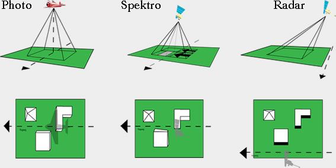

```{r setup, include=FALSE}
options(htmltools.dir.version = FALSE)
```

```{r xaringan-all, echo=FALSE}
library(countdown)
library(xaringan)
library(xaringanExtra)
library(knitr)

hook_source <- knitr::knit_hooks$get('source')
knitr::knit_hooks$set(source = function(x, options) {
  x <- stringr::str_replace(x, "^[[:blank:]]?([^*].+?)[[:blank:]]*#<<[[:blank:]]*$", "*\\1")
  hook_source(x, options)
})

xaringanExtra::use_broadcast()
xaringanExtra::use_freezeframe()
xaringanExtra::use_scribble()
#xaringanExtra::use_slide_tone()
xaringanExtra::use_search(show_icon = TRUE)
xaringanExtra::use_freezeframe()
xaringanExtra::use_clipboard()
xaringanExtra::use_tile_view()
xaringanExtra::use_panelset()
xaringanExtra::use_editable(expires = 1)
xaringanExtra::use_fit_screen()
xaringanExtra::use_extra_styles(
  hover_code_line = TRUE,         
  mute_unhighlighted_code = TRUE  
)

```

class: inverse, center, title-slide, middle

<style>
.title-slide .remark-slide-number {
  display: none;
}
</style>

```{r load_packages, message=FALSE, warning=FALSE, include=FALSE}
library(fontawesome)
```

# Remotely Sensing Cities and Environments

### Lecture 3: Landsat, corrections and merging imagery

### 02/02/2022 (updated: `r format(Sys.time(), "%d/%m/%Y")`)

`r fa("paper-plane", fill = "white")`[a.maclachlan@ucl.ac.uk](mailto:a.maclachlan@ucl.ac.uk)
`r fa("twitter", fill = "white")`[andymaclachlan](https://twitter.com/andymaclachlan)
`r fa("github", fill = "white")`[andrewmaclachlan](https://github.com/andrewmaclachlan)
`r fa("map-marker", fill = "white")`[Centre for Advanced Spatial Analysis, UCL](https://www.ucl.ac.uk/bartlett/casa/)

<a href="https://github.com/andrewmaclachlan" class="github-corner" aria-label="View source on GitHub"><svg width="80" height="80" viewBox="0 0 250 250" style="fill:#fff; color:#151513; position: absolute; top: 0; border: 0; left: 0; transform: scale(-1, 1);" aria-hidden="true"><path d="M0,0 L115,115 L130,115 L142,142 L250,250 L250,0 Z"></path><path d="M128.3,109.0 C113.8,99.7 119.0,89.6 119.0,89.6 C122.0,82.7 120.5,78.6 120.5,78.6 C119.2,72.0 123.4,76.3 123.4,76.3 C127.3,80.9 125.5,87.3 125.5,87.3 C122.9,97.6 130.6,101.9 134.4,103.2" fill="currentColor" style="transform-origin: 130px 106px;" class="octo-arm"></path><path d="M115.0,115.0 C114.9,115.1 118.7,116.5 119.8,115.4 L133.7,101.6 C136.9,99.2 139.9,98.4 142.2,98.6 C133.8,88.0 127.5,74.4 143.8,58.0 C148.5,53.4 154.0,51.2 159.7,51.0 C160.3,49.4 163.2,43.6 171.4,40.1 C171.4,40.1 176.1,42.5 178.8,56.2 C183.1,58.6 187.2,61.8 190.9,65.4 C194.5,69.0 197.7,73.2 200.1,77.6 C213.8,80.2 216.3,84.9 216.3,84.9 C212.7,93.1 206.9,96.0 205.4,96.6 C205.1,102.4 203.0,107.8 198.3,112.5 C181.9,128.9 168.3,122.5 157.7,114.1 C157.9,116.9 156.7,120.9 152.7,124.9 L141.0,136.5 C139.8,137.7 141.6,141.9 141.8,141.8 Z" fill="currentColor" class="octo-body"></path></svg></a><style>.github-corner:hover .octo-arm{animation:octocat-wave 560ms ease-in-out}@keyframes octocat-wave{0%,100%{transform:rotate(0)}20%,60%{transform:rotate(-25deg)}40%,80%{transform:rotate(10deg)}}@media (max-width:500px){.github-corner:hover .octo-arm{animation:none}.github-corner .octo-arm{animation:octocat-wave 560ms ease-in-out}}</style>


---
class: inverse, center, middle
# This lecture and practical are solely about getting started with the two data science tools we will use `r emo::ji("book")`

# 1. Xaringan for group presentations*

# 2. Bookdown for individual portofios 

###* there will also be a short group contributions form to complete 

---

# How to use the lectures

- Slides are made with [xaringan](https://slides.yihui.org/xaringan/#1)

- `r fa("search")` In the bottom left there is a search tool which will search all content of presentation

- Control + F will also search 

- Press enter to move to the next result 

- `r fa("pencil-alt")` In the top right let's you draw on the slides, although these aren't saved.

- Pressing the letter `o` (for overview) will allow you to see an overview of the whole presentation and go to a slide

- Alternatively just typing the slide number e.g. 10 on the website will take you to that slide

- Pressing alt+F will fit the slide to the screen, this is useful if you have resized the window and have another open - side by side. 

```{r xaringan-logo, echo=FALSE}
xaringanExtra::use_logo(
  image_url = "img/casa_logo.jpg"
)
```
---


# Outline


---
class: inverse, center, middle

# Pre-processing requirements

Occasionally remotely sensed images can contain flaws within them


---

# Scan lines

---
class: inverse, center, middle


# Geometric correction 

---

# Geometric correction

We have seen in GIS that a satellite image is given a coordinate reference system.

But when remotely sensed data is collected image distortions can be introduced due to:

* View angle (off-nadir)* - [Nadir means directly down](https://space.stackexchange.com/questions/19727/in-spacecraft-talk-is-nadir-just-a-fancy-word-for-down)
* Topography (e.g. hills not flat ground)
* Wind (if from a plane)
* Rotation of the earth (from satellite) 

.pull-left[

```{r echo=FALSE, out.width='80%', fig.align='center'}

```
.small[Geometric distortion from sensor view angles. Source:[Remote Sensing in Schools](https://fis.uni-bonn.de/en/recherchetools/infobox/professionals/preprocessing/geometric-correction)
]
]

.pull-right[

```{r echo=FALSE, out.width='80%', fig.align='center'}

```
.small[Geometric distortion from Earth rotation. Source:[Remote Sensing in Schools](https://fis.uni-bonn.de/en/recherchetools/infobox/professionals/preprocessing/geometric-correction)
]
]

---
# Look angles

<center>

</center>

.small[Geometric distortion from sensor view angles. Source:[Remote Sensing in Schools](https://fis.uni-bonn.de/en/recherchetools/infobox/professionals/preprocessing/geometric-correction)
]
---

# Geometric correction solution

* We identify Ground Control Points (GPS) to match known points in the image and a reference dataset
  * local map 
  * another image
  * GPS data from handheld device 
  
.pull-left[

* We take the coordinates and model them to give geometric transformation coefficients 
* Think back to GIS - linear regression with our distorted x or y as the dependent

* We then plot these and try to minimise the RMSE - Jensen sets a RMSE value of 0.5
]


.pull-right[

* There are [many transformation algorithms available](https://gis.stackexchange.com/questions/153227/transformation-types-in-geo-referencing-of-qgis) to model the actual coordinates

* This is the same process if you have ever seen an old map sheet overlaid to in a GIS.
]
---

# Geometric correction solution 2...

RMSE
  * (observed - predicted (the residual))^2
  * sum them and divide by number of data points
  * square root that total
  
* [The model with the lowest RMSE will fit best](https://gis.stackexchange.com/questions/8900/generally-accepted-root-mean-square-rms-error-for-rectifying-topographic-maps) ...   

When we do this we also might shift the data slightly ...so we must re-sample the final raster:

.pull-left[
  * Nearest Neighbor
  * Linear
  * Cubic
  * Cubic spline
]

.pull-right[
```{r echo=FALSE, out.width='100%', fig.align='center'}

```
.small[Resampling. Source:[Richard Treves](https://www2.geog.soton.ac.uk/users/trevesr/obs/rseo/geometric_correction.html)
]
]
---

# Atmospheric correction  

According to Jensen the two most important sources of environmental attenuation are:

* Atmospheric scattering (as we saw in week 1)
* Topographic attenuation (up next)

Jensen goes on to discuss necessary and unnecessary atmospheric correction:

.pull-left[
**Unnecessary**

* Classification of a single image 
* Independent classification of multi date imagery 
* Composite images (combining images)
* Single dates or where training data extracted from all data
]

.pull-right[
**Necessary**
* Biophysical parameters needed (e.g. temperature, leaf area index, NDVI)
* E.g. .. .NDVI is used in the Africa Famine Early Warning System and Livestock Early Warning System
* Using spectral signatures through time and space


]


---
# Atmospheric correction types

### Relative 


* Normalize intensities of different bands within a single image
* Normalise intensities of bands from many dates to one date

.pull-left[ 
* Dark object subtraction (DOS) or histogram adjustment 
  * Searches each band for the darkest value then subtracts that from each pixel 
  * Landsat bands 1-3 (visible) have increased scattering vs longer wavelengths
]

.pull-right[ 

* Psuedo-invariant Features (PIFs)  
  * Assume brightness pixels linearly related to a base image...
  * Regression per band $y=1.025x+21.152$
  * Adjust the image based on the regression result. 
  * Here y is the value of our base. To get y we multiply our new date pixel (x) by the coefficient and add the intercept value.
  * Apply this to the rest of the pixels..
  
]

---

# Atmospheric correction types 2

.pull-left[ 
```{r echo=FALSE, out.width='100%', fig.align='center'}

```
.small[Three modalities regarding the atmospheric correction have been retained: (A) none; (B) empirical Dark object Subtraction (DS); and (C) analytical FLAASH correction. Lower plots represent spectral signatures of five features (golden stars over images) against the three modalities. Source:[Collin and Hench, 2012](https://www.mdpi.com/2072-4292/4/5/1425/htm)

]
]

.pull-right[
```{r echo=FALSE, out.width='50%', fig.align='center'}

```
.small[PIFs between datasets from different dates - lnland Wetland Change Detection in the Everglades Water Conservation Area 2A Using a Time Series of Normalized Remotely Sensed Data. Source:[Jensen et al. 1995, 2012](https://www.asprs.org/wp-content/uploads/pers/1995journal/feb/1995_feb_199-209.pdf)

]
]


---
# Atmospheric correction types 3

### Absolute 

* Change digital brightness values into scaled surface reflectance. We can **then compare these scaled surface reflectance values across the planet**

* We do this through **atmospheric radiative transfer models** and there are many to select from 

* **However, nearly all assume atmospheric measurements are available** which are used to "invert" the image radiance to scaled surface reflectance

* The scattering and absorption information comes from atmopshierc radiative transfer code such as MODTRAN 4+ and the Second Simulation of the Satellite Signal in the Solar Spectrum (6S), which can now be used through python - [called Py6S](https://py6s.readthedocs.io/en/latest/audience.html)

---

# Atmospheric correction types 4

.pull-left[ 
### Absolute Data requirements

* An atmopsheric model (summer, tropical) - usually you can select from the tool
* Local atmopsheric visibility - from a weather station, like airports
* Image altitude 
]

.pull-right[
### Absolute Tools $$$

* ACORN - Atmopsehic CORection Now
* FLAASH - Fast Line of-sight Atmopsheric Analysis 
* QUAC - Quick Atmopsheric Correction 
* ATCOR - The ATmospheric CORrection program 


Free
* SMAC - [Simplified Model for Atmospheric Correction (SMAC)](https://github.com/olivierhagolle/SMAC)
* [Orfeo Toolbox](https://www.orfeo-toolbox.org/CookBook/Applications/app_OpticalCalibration.html)
]


---
# Atmospheric correction types 5

### Empirical Line Correction 

* We can go and take measurements in situ using a field spectrometer 

* This does require measurements at the same time as the satellite overpass....

.pull-left[
```{r echo=FALSE, out.width='95%', fig.align='center'}
knitr::include_graphics('img/calibration_panel2.jpg')
```
.small[Source: Andy MacLachlan]
]

.pull-right[
```{r echo=FALSE, out.width='65%', fig.align='center'}
knitr::include_graphics('img/calibration_panel.jpg')
```
.small[Source: Andy MacLachlan]
]

---

# Atmospheric correction types 6

### Empirical Line Correction 

Then use these measurements in [linear regression against the satellite data raw digital number](https://www.l3harrisgeospatial.com/docs/atmosphericcorrection.html#empirical_line_calibration)

.center[

$BV_k= p_\lambda A_k +B_k$

$BV_k$ is the Digital number for band K

$p_\lambda$ is the surface reflenctance from the filed survey

$B_k$ is the additive term...or...

$Reflectance (field spectrum) = gain * radiance (input data) + offset$]

---

# Remote sensing jargon 

We saw in CASA0005 and we will see in this module the terms gain and offset...

Before a sensor is launched it is calibrated in a lab - we then use these measurements to adjust the data from the sensor...


```{r echo=FALSE, out.width='65%', fig.align='center'}

```
.small[Calibration of 8-bit satellite data. Gain represents the gradient of the calibration. Bias defines the spectral radiance of the sensor for a DN of zero. Source:[Lesson 3: Radiometric correction of satellite images](https://www.ncl.ac.uk/tcmweb/bilko/module7/lesson3.pdf)
]
---

class: inverse, center, middle

# Review of atmospheric correction

<iframe width="560" height="315" src="https://www.youtube.com/embed/qb4yFwzsnU8" title="YouTube video player" frameborder="0" allow="accelerometer; autoplay; clipboard-write; encrypted-media; gyroscope; picture-in-picture" allowfullscreen></iframe>

---
class: inverse, center, middle


# Orthorectification correction  


---

# Orthorectification correction  

Requires:

* Sensor geometry 
* An elevation model 

```{r echo=FALSE, out.width='55%', fig.align='center'}
knitr::include_graphics("img/orthorectification.jpg")
```
.small[A view captured from an oblique angle (for example, 25°, left) must be corrected for relief displacement caused by terrain to generate the orthorectified view (looking straight down, right). Orthoimagery is produced by calculating the nadir view for every pixel. Source:[Esri Insider, 2016](https://www.esri.com/about/newsroom/insider/what-is-orthorectified-imagery/)
]

---

https://grass.osgeo.org/grass78/manuals/i.ortho.photo.html

---


class: inverse, center, middle

# Radiometric Calibration

---


