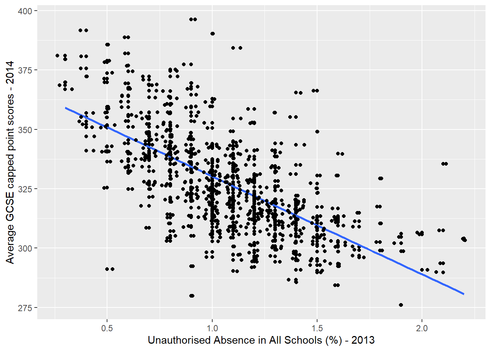
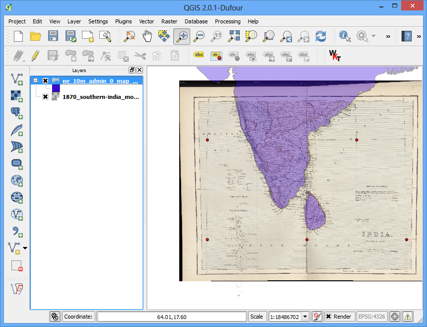
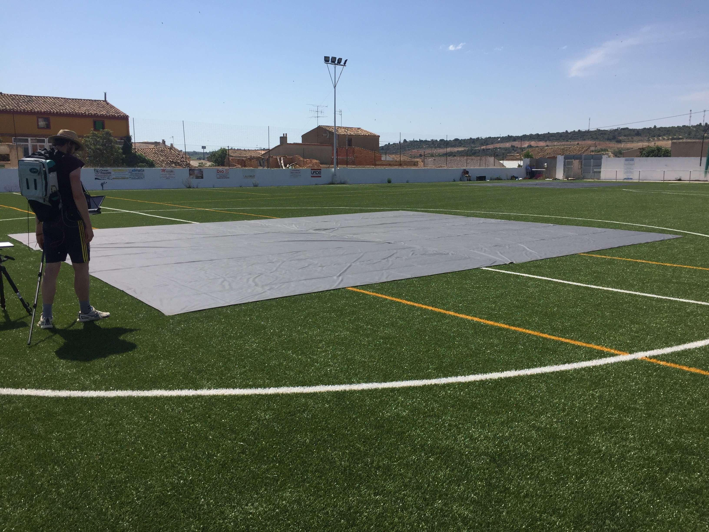

```{r setup, include=FALSE}
options(htmltools.dir.version = FALSE)
```

```{r xaringan-all, echo=FALSE}
library(countdown)
library(xaringan)
library(xaringanExtra)
library(knitr)
library(emo)

hook_source <- knitr::knit_hooks$get('source')
knitr::knit_hooks$set(source = function(x, options) {
  x <- stringr::str_replace(x, "^[[:blank:]]?([^*].+?)[[:blank:]]*#<<[[:blank:]]*$", "*\\1")
  hook_source(x, options)
})

xaringanExtra::use_broadcast()
xaringanExtra::use_freezeframe()
xaringanExtra::use_scribble()
#xaringanExtra::use_slide_tone()
xaringanExtra::use_search(show_icon = TRUE, auto_search	=FALSE)
xaringanExtra::use_freezeframe()
xaringanExtra::use_clipboard()
xaringanExtra::use_tile_view()
xaringanExtra::use_panelset()
xaringanExtra::use_editable(expires = 1)
xaringanExtra::use_fit_screen()
xaringanExtra::use_extra_styles(
  hover_code_line = TRUE,         
  mute_unhighlighted_code = TRUE  
)

```

class: center, title-slide, middle

background-image: url("img/CASA_Logo_no_text_trans_17.png")
background-size: cover
background-position: center


<style>
.title-slide .remark-slide-number {
  display: none;
}
</style>

```{r load_packages, message=FALSE, warning=FALSE, include=FALSE}
library(fontawesome)
```

# Remotely Sensing Cities and Environments

### Lecture 3: Remote sensing data

### 02/02/2022 (updated: `r format(Sys.time(), "%d/%m/%Y")`)

`r fa("paper-plane", fill = "#562457")`[a.maclachlan@ucl.ac.uk](mailto:a.maclachlan@ucl.ac.uk)
`r fa("twitter", fill = "#562457")`[andymaclachlan](https://twitter.com/andymaclachlan)
`r fa("github", fill = "#562457")`[andrewmaclachlan](https://github.com/andrewmaclachlan)
`r fa("location-dot", fill = "#562457")`[Centre for Advanced Spatial Analysis, UCL](https://www.ucl.ac.uk/bartlett/casa/)

<a href="https://github.com/andrewmaclachlan" class="github-corner" aria-label="View source on GitHub"><svg width="80" height="80" viewBox="0 0 250 250" style="fill:#fff; color:#151513; position: absolute; top: 0; border: 0; left: 0; transform: scale(-1, 1);" aria-hidden="true"><path d="M0,0 L115,115 L130,115 L142,142 L250,250 L250,0 Z"></path><path d="M128.3,109.0 C113.8,99.7 119.0,89.6 119.0,89.6 C122.0,82.7 120.5,78.6 120.5,78.6 C119.2,72.0 123.4,76.3 123.4,76.3 C127.3,80.9 125.5,87.3 125.5,87.3 C122.9,97.6 130.6,101.9 134.4,103.2" fill="#562457" style="transform-origin: 130px 106px;" class="octo-arm"></path><path d="M115.0,115.0 C114.9,115.1 118.7,116.5 119.8,115.4 L133.7,101.6 C136.9,99.2 139.9,98.4 142.2,98.6 C133.8,88.0 127.5,74.4 143.8,58.0 C148.5,53.4 154.0,51.2 159.7,51.0 C160.3,49.4 163.2,43.6 171.4,40.1 C171.4,40.1 176.1,42.5 178.8,56.2 C183.1,58.6 187.2,61.8 190.9,65.4 C194.5,69.0 197.7,73.2 200.1,77.6 C213.8,80.2 216.3,84.9 216.3,84.9 C212.7,93.1 206.9,96.0 205.4,96.6 C205.1,102.4 203.0,107.8 198.3,112.5 C181.9,128.9 168.3,122.5 157.7,114.1 C157.9,116.9 156.7,120.9 152.7,124.9 L141.0,136.5 C139.8,137.7 141.6,141.9 141.8,141.8 Z" fill="#562457" class="octo-body"></path></svg></a><style>.github-corner:hover .octo-arm{animation:octocat-wave 560ms ease-in-out}@keyframes octocat-wave{0%,100%{transform:rotate(0)}20%,60%{transform:rotate(-25deg)}40%,80%{transform:rotate(10deg)}}@media (max-width:500px){.github-corner:hover .octo-arm{animation:none}.github-corner .octo-arm{animation:octocat-wave 560ms ease-in-out}}</style>

---

```{r, echo=FALSE}
xaringanExtra::use_progress_bar(color = "#0051BA", location = "bottom")
```

# How to use the lectures

- [Fastcups](https://cups.fast.ai/CASA0023):https://cups.fast.ai/CASA0023)

- Slides are made with [xaringan](https://slides.yihui.org/xaringan/#1)

- `r fa("magnifying-glass")` In the bottom left there is a search tool which will search all content of presentation

- Control + F will also search 

- Press enter to move to the next result 

- `r fa("pencil")` In the top right let's you draw on the slides, although these aren't saved.

- Pressing the letter `o` (for overview) will allow you to see an overview of the whole presentation and go to a slide

- Alternatively just typing the slide number e.g. 10 on the website will take you to that slide

- Pressing alt+F will fit the slide to the screen, this is useful if you have resized the window and have another open - side by side. 

```{r xaringan-logo, echo=FALSE}
xaringanExtra::use_logo(
  image_url = "img/casa_logo.jpg",
  width = "50px",
  position = xaringanExtra::css_position(top = "1em", right = "2em")

)
```
---

class: inverse, center, middle


# Before we begin 


---

# A Trip Through Time With Landsat 9


.center[
<iframe width="560" height="315" src="https://www.youtube.com/embed/up9oDz49QXI?start=200" title="YouTube video player" frameborder="0" allow="accelerometer; autoplay; clipboard-write; encrypted-media; gyroscope; picture-in-picture" allowfullscreen></iframe>
]

.small[A Trip Through Time With Landsat 9 .Source:[NASA Goddard](https://svs.gsfc.nasa.gov/13890)
]

---

# The woman who brought us the world


.pull-left[

* NASA wanted to use a RBV camera - TV camera

* Norwood thought that a digital Multispectral camera (MSS) would be much better.

* MSS

* Norwood given $100,000

* NASA doubted it could be digital 

* Used a pivoting mirror not scanner

* NASA would use this and it became **the standard for the future of remote sensing**

]

.pull-right[

``````{r echo=FALSE, out.width='100%', fig.align='center'}
knitr::include_graphics('img/norwood.png')
```
.small[Norwood and Labor Secretary James Hodgson discuss how Landsat’s multispectral scanner works at a conference in 1972.Source:[MIT Technology Review. COURTESY OF VIRGINIA NORWOOD](https://www.technologyreview.com/2021/06/29/1025732/the-woman-who-brought-us-the-world/)
]]

---

# The woman who brought us the world 2

.pull-left[

* No time for a final product

* The prototype was used on the satellite 

* Still, most people thought the tv cameras were more useful `r emo::ji("silly")`

]

.pull-right[

``````{r echo=FALSE, out.width='100%', fig.align='center'}

```
.small[A test version of Norwood’s multispectral scanner captured this false-color image of Half Dome from a truck two months before Landsat 1’s launch.Source:[MIT Technology Review. COURTESY OF NASA](https://www.technologyreview.com/2021/06/29/1025732/the-woman-who-brought-us-the-world/)
]]


---

# The woman who brought us the world 3


``````{r echo=FALSE, out.width='75%', fig.align='center'}
knitr::include_graphics('img/5262-Landsat-timeline-FNL-2.jpg')
```
.small[Landsat Satellite Missions.Source:[USGS](https://www.usgs.gov/landsat-missions/landsat-satellite-missions)]


---
# The woman who brought us the world 4


``````{r echo=FALSE, out.width='100%', fig.align='center'}

```
.small[Landsat Downloads and Use Data .Source:[Goddard Media Studios](https://svs.gsfc.nasa.gov/11458)]


---
# Lecture outline

.pull-left[

### Part 1: corrections

* Geometric

* Atmospheric 

* Orthorectification / Topographic correction

* Radiometric 

### Part 2: data joining and enhancement  

* Feathering 

* Image enhancement 

]

.pull-right[
```{r echo=FALSE, out.width='100%'}
knitr::include_graphics('img/satellite.png')
```
.small[Source:[Original from the British Library. Digitally enhanced by rawpixel.](https://www.rawpixel.com/image/571789/solar-generator-vintage-style)
]]

???

Note these down and add explanations 

---
class: inverse, center, middle

# Pre-processing requirements

## Occasionally remotely sensed images can contain flaws within them

## These can be from the sensor, the atmopshere, the terrain ...and more!

---

# Scan lines

A rather famous example is when the scan line corrector on Landsat 7 failed... 

It moves in a zig zag and the corrector made the image normal

.pull-left[

```{r echo=FALSE, out.width='100%', fig.align='center'}

```
.small[Source:[USGS](https://www.usgs.gov/landsat-missions/landsat-7?qt-science_support_page_related_con=0#qt-science_support_page_related_con)
]
]

.pull-right[

```{r echo=FALSE, out.width='80%', fig.align='center'}

```
.small[Source:[USGS](https://www.usgs.gov/landsat-missions/landsat-7?qt-science_support_page_related_con=0#qt-science_support_page_related_con)
]
]

Imagery was still distributed but it is hard to use with methods developed to estiamte the gaps, termed gap filling. 

---
# Recall regression....

.pull-left[

We will see this **three times** throughout the next few slides...

$$y_i = \beta_0 + \beta_1x_i + \epsilon_i$$

where:

$\beta_0$ is the intercept (the value of $y$ when $x = 0$)

$\beta_1$ the 'slope'  the change in the value of $y$ for a 1 unit change in the value of $x$ (the slope of the blue line)

$\epsilon_i$ is a random error term (positive or negative) 

Any value of $y$ along the blue line can be modeled using the corresponding value of $x$ 

]
.pull-right[

```{r echo=FALSE, out.width='100%', fig.align='center'}

```
.small[Source:[CASA0005](https://andrewmaclachlan.github.io/CASA0005repo/explaining-spatial-patterns.html#analysing-gcse-exam-performance---testing-a-research-hypothesis)
]

what are the factors that might lead to variation in Average GCSE point scores:
* independent **predictor** variable (unauthorised absence)
* dependent variable (GCSE point score)
]

---
class: inverse, center, middle


# Geometric correction 

---

# Geometric correction

We have seen in GIS that a satellite image is given a coordinate reference system.

But when remotely sensed data is collected image distortions can be introduced due to:

* View angle (off-nadir)* - [Nadir means directly down](https://space.stackexchange.com/questions/19727/in-spacecraft-talk-is-nadir-just-a-fancy-word-for-down)
* Topography (e.g. hills not flat ground)
* Wind (if from a plane)
* Rotation of the earth (from satellite) 

.pull-left[

```{r echo=FALSE, out.width='80%', fig.align='center'}
knitr::include_graphics('img/image_acuisition_distortion.jpg')
```
.small[Geometric distortion from sensor view angles. Source:[Remote Sensing in Schools](https://fis.uni-bonn.de/en/recherchetools/infobox/professionals/preprocessing/geometric-correction)
]
]

.pull-right[

```{r echo=FALSE, out.width='80%', fig.align='center'}
knitr::include_graphics('img/earth_rotation.jpg')
```
.small[Geometric distortion from Earth rotation. Source:[Remote Sensing in Schools](https://fis.uni-bonn.de/en/recherchetools/infobox/professionals/preprocessing/geometric-correction)
]
]

---

# Geometric correction
```{r echo=FALSE, out.width='55%', fig.align='center'}
knitr::include_graphics('img/Geometric-correction-procedures.png')
```
.small[Source:[Abdul Basith](https://www.researchgate.net/figure/Geometric-correction-procedures_fig7_320710942)]

---

# Geometric correction solution

* We identify Ground Control Points (GPS) to match known points in the image and a reference dataset
  * local map 
  * another image
  * GPS data from handheld device 
  
.pull-left[

* We take the coordinates and model them to give geometric transformation coefficients 
* Think back to GIS - linear regression with our distorted x or y as the dependent

* We then plot these and try to minimise the RMSE - Jensen sets a RMSE value of 0.5
]


.pull-right[

* There are [many transformation algorithms available](https://gis.stackexchange.com/questions/153227/transformation-types-in-geo-referencing-of-qgis) to model the actual coordinates

* This is the same process if you have ever seen an old map sheet overlaid to in a GIS.
]
---

# Geometric correction solution 2...

RMSE
  * (observed - predicted (the residual))^2
  * sum them and divide by number of data points
  * square root that total
  
* [The model with the lowest RMSE will fit best](https://gis.stackexchange.com/questions/8900/generally-accepted-root-mean-square-rms-error-for-rectifying-topographic-maps) ...  Jensen sets a RMSE value of 0.5

When we do this we also might shift the data slightly ...so we must re-sample the final raster:

.pull-left[

Resample methods

* Nearest Neighbor
* Linear
* Cubic
* Cubic spline
]

.pull-right[
```{r echo=FALSE, out.width='100%', fig.align='center'}
knitr::include_graphics('img/Resampling.jpg')
```
.small[Resampling. Source:[Richard Treves](https://www2.geog.soton.ac.uk/users/trevesr/obs/rseo/geometric_correction.html)
]
]
---
# Geometric correction solution 2...

This is the same process used when you see an old map (e.g. printed or manual) in a GIS

```{r echo=FALSE, out.width='70%', fig.align='center'}

```
.small[Source:[QGIS Tutorials and Tips](https://fis.uni-bonn.de/en/recherchetools/infobox/professionals/preprocessing/geometric-correction)
]
---

class: inverse, center, middle


# Atmospheric correction 

---
# Atmospheric correction  

According to Jensen the two most important sources of environmental attenuation are:

* Atmospheric scattering (as we saw in week 1)
* Topographic attenuation (up next)

Jensen goes on to discuss necessary and unnecessary atmospheric correction:

.pull-left[
**Unnecessary**

* Classification of a single image 
* Independent classification of multi date imagery 
* Composite images (combining images)
* Single dates or where training data extracted from all data
]

.pull-right[
**Necessary**
* Biophysical parameters needed (e.g. temperature, leaf area index, NDVI)
* E.g. .. .NDVI is used in the Africa Famine Early Warning System and Livestock Early Warning System
* Using spectral signatures through time and space


]

---
# Atmospheric correction in action

```{r echo=FALSE, out.width='60%', fig.align='center'}

```
.small[Atmospheric correction examples of three scenes (Bands 1, 2, and 3). Source:[Liang et al. 2001](https://www.researchgate.net/figure/Atmospheric-correction-examples-of-three-scenes-Bands-1-2-and-3-The-first-row-shows_fig6_3202775)
]

Absorption and scattering create the haze = reduces contrast of image.

Scattering = can create the “adjacency effect”, radiance from pixels nearby mixed into pixel of interest. 

.small[Source:[Newcastle Univesrity](https://www.ncl.ac.uk/tcmweb/bilko/module7/lesson3.pdf)
]
---

# Atmospheric correction types

### Relative (to something)


* Normalize intensities of different bands within a single image
* Normalise intensities of bands from many dates to one date

.pull-left[ 
* Dark object subtraction (DOS) or histogram adjustment 
  * Searches each band for the darkest value then subtracts that from each pixel 
  * Landsat bands 1-3 (visible) have increased scattering vs longer wavelengths
]

.pull-right[ 

* Psuedo-invariant Features (PIFs)  
  * Assume brightness pixels linearly related to a base image...
  * Regression per band $y=1.025x+21.152$
  * Adjust the image based on the regression result. 
  * Here y is the value of our base. To get y we multiply our new date pixel (x) by the coefficient and add the intercept value.
  * Apply this to the rest of the pixels..
  
]

---

# Atmospheric correction types 2

.pull-left[ 
```{r echo=FALSE, out.width='100%', fig.align='center'}
knitr::include_graphics("img/DOS.png")
```
.small[Three modalities regarding the atmospheric correction have been retained: (A) none; (B) empirical Dark object Subtraction (DS); and (C) analytical FLAASH correction. Lower plots represent spectral signatures of five features (golden stars over images) against the three modalities. Source:[Collin and Hench, 2012](https://www.mdpi.com/2072-4292/4/5/1425/htm)

]
]

.pull-right[
```{r echo=FALSE, out.width='50%', fig.align='center'}
knitr::include_graphics("img/PIFs.png")
```
.small[PIFs between datasets from different dates - lnland Wetland Change Detection in the Everglades Water Conservation Area 2A Using a Time Series of Normalized Remotely Sensed Data. Source:[Jensen et al. 1995, 2012](https://www.asprs.org/wp-content/uploads/pers/1995journal/feb/1995_feb_199-209.pdf)

]
]

---
class: inverse, center, middle


# Pause...

## Why is the figure on the left of the previous slide not so great and misleading...?

--

## Always be critical

## Even of published work


---
# Atmospheric correction types 3

### Absolute (definitive)

* Change digital brightness values into scaled surface reflectance. We can **then compare these scaled surface reflectance values across the planet**

* We do this through **atmospheric radiative transfer models** and there are many to select from 

* **However, nearly all assume atmospheric measurements are available** which are used to "invert" the image radiance to scaled surface reflectance

* The scattering and absorption information comes from atmopshierc radiative transfer code such as MODTRAN 4+ and the Second Simulation of the Satellite Signal in the Solar Spectrum (6S), which can now be used through python - [called Py6S](https://py6s.readthedocs.io/en/latest/audience.html)

---

# Atmospheric correction types 4

.pull-left[ 
### Absolute Data requirements

* An atmopsheric model (summer, tropical) - usually you can select from the tool
* Local atmopsheric visibility - from a weather station, like airports
* Image altitude 
]

.pull-right[
### Absolute Tools $$$

* ACORN - Atmopsehic CORection Now
* FLAASH - Fast Line of-sight Atmopsheric Analysis 
* QUAC - Quick Atmopsheric Correction 
* ATCOR - The ATmospheric CORrection program 
* See Jensen page 216


Free
* SMAC - [Simplified Model for Atmospheric Correction (SMAC)](https://github.com/olivierhagolle/SMAC)
* [Orfeo Toolbox](https://www.orfeo-toolbox.org/CookBook/Applications/app_OpticalCalibration.html)
]


---
# Atmospheric correction types 5

### Empirical Line Correction 

* We can go and take measurements in situ using [a field spectrometer](https://fsf.nerc.ac.uk/resources/guides/pdf_guides/asd_guide_v2_wr.pdf) 

* This does require measurements at the same time as the satellite overpass....

.pull-left[
```{r echo=FALSE, out.width='95%', fig.align='center'}

```
.small[Source: Andy MacLachlan]
]

.pull-right[
```{r echo=FALSE, out.width='65%', fig.align='center'}

```
.small[Source: Andy MacLachlan]
]

---

# Empirical Line Correction

Then use these measurements in [linear regression against the satellite data raw digital number](https://www.l3harrisgeospatial.com/docs/atmosphericcorrection.html#empirical_line_calibration)

.center[

$BV_k= p_\lambda A_k +B_k$


$BV_k$ is the Digital number for band K


$p_\lambda$ is the surface reflenctance from the filed survey


$B_k$ is the additive term, depicting the atmospheric path radiance component (scattering) across different paths of reflectance...see next slides


The slope = attenuated (dimming and blurring from scattering of light) atmospheric correction. This is the electromagnetic wave absorption and scattering by the atmosphere.

...or...
]
---


# Empirical Line Correction 2


$Reflectance (field spectrum) = gain * radiance (input data) + offset$

```{r echo=FALSE, out.width='50%', fig.align='center'}
knitr::include_graphics('img/Application-of-the-empirical-line-atmospheric-correction-method-The-intercept-on-the.png')
```

.small[Source:[Source: David P. Groeneveld](https://www.researchgate.net/figure/Example-of-an-empirical-line-using-two-targets-of-contrasting-albedo_fig1_241396033)]

---

# Empirical Line Correction 3

Path radiance and atmospheric attenuation 

.pull-left[

**Path radiance**

```{r echo=FALSE, out.width='100%', fig.align='center'}

```
.small[[Atmospheric effect on radiation measured by remote sensors](https://ohioline.osu.edu/factsheet/fabe-5541)
]
]


.pull-right[

**Atmospheric attenuation**

```{r echo=FALSE, out.width='100%', fig.align='center'}
knitr::include_graphics("img/Atmospheric-Electromagnetic-Opacity.png")
```
.small[Source: [GIS geography](https://gisgeography.com/atmospheric-window/)]
]

---

class: inverse, center, middle

# Review of atmospheric correction

<iframe width="560" height="315" src="https://www.youtube.com/embed/qb4yFwzsnU8" title="YouTube video player" frameborder="0" allow="accelerometer; autoplay; clipboard-write; encrypted-media; gyroscope; picture-in-picture" allowfullscreen></iframe>

---
class: inverse, center, middle


# Orthorectification correction / topographic correction

---

# Orthorectification correction  

A **subset** of georectification 

* georectification = giving coordinates to an image 

* orthorectification = removing distortions... making the pixels viewed at nadir (straight down)

.pull-left[
Requires:

* Sensor geometry 
* An elevation model

]


.pull-right[
```{r echo=FALSE, out.width='100%', fig.align='center'}
knitr::include_graphics("img/orthorectification.jpg")
```
.small[A view captured from an oblique angle (for example, 25°, left) must be corrected for relief displacement caused by terrain to generate the orthorectified view (looking straight down, right). Orthoimagery is produced by calculating the nadir view for every pixel. Source:[Esri Insider, 2016](https://www.esri.com/about/newsroom/insider/what-is-orthorectified-imagery/)
]
]

---
class: inverse, center, middle


# Spot the **main** difference

---
# Orthorectification correction 2


```{r echo=FALSE, out.width='80%', fig.align='center'}

```

--
.small[Orthorectification creates a final product whereby each pixel in the image is depicted as if it were collected from directly overhead or as close to this as possible. In the graphic above, you can see a path through the forest going from the northwest to the southeast. On the left is the original image, and on the right is the orthorectified image. In the orthorectified version, you can see that the path is now nearly straight after the influence of topography has been removed from the image. (Graphic Credit: David DiBiase, Penn State University). Source:[Apollo Mapping, 2016](https://apollomapping.com/blog/g-faq-orthorectification-part)
]

---
# Orthorectification correction 3

### Software / formulas to do this...

Jensen covers the following formulas:

* Cosine correction

  * $L_H= L_T\frac{cos\theta_O}{\cos_i}$
  
  Where
  * $L_T$ = radiance (DN to TOA) from sloped terrain
  * $\theta_O$ = Sun's zenith angle
  * $i$ = Sun's incidence angle - cosine of the angle between the solar zenith
and the normal line of the slope
  * Latter two found in angle coefficient files (e.g. Landsat data ANG.txt)

Others:
* Minnaert correction
* Statistical Empirical correction 
* C Correction (advancing the Cosine)

---
# Orthorectification correction 4

```{r echo=FALSE, out.width='30%', fig.align='center'}
knitr::include_graphics("img/vza-sza.png")
```
.small[Schematic illustration of the Solar Zenith Angle (SZA) and Viewing Zenith Angle (VZA) for observations from satellite-based instrument. [image taken from a NASA page](https://sacs.aeronomie.be/info/sza.php)
]

To get $cos_i$

$cos_i= cos\theta_p cos\theta_z + sin\theta_p sin\theta_zcos(\phi_a-\phi_o)$

Where:

$\theta_p$ = slope angle (from DEM)
$\theta_z$ = solar zenith
$\phi_a$ = slope aspect (orientation of the slope from DEM)
$\phi_o$ = solar azimuth


---
# Orthorectification correction 5

solar azimuth = compass angle of the sun (N =0°) 90° (E) at sunrise and 270° (W) at sunset. See [Azimuth Angle animation](https://www.pveducation.org/pvcdrom/properties-of-sunlight/azimuth-angle)


solar zenith = angle of local zenith (above the point on ground) and sun from vertical (90° - elevation)

.pull-left[

```{r echo=FALSE, out.width='100%', fig.align='center'}

```
.small[Solar zenith and solar azimuth Source:[catalyst.earth](https://catalyst.earth/catalyst-system-files/help/concepts/focus_c/atcor_aboutZenithAzimuth.html)
]
]

.pull-right[

```{r echo=FALSE, out.width='100%', fig.align='center'}

```
.small[Solar azimuth and zenith angles Source:[Khurum Nazir Junejo](https://www.researchgate.net/figure/Solar-azimuth-and-zenith-angles_fig7_308362887)
]
]

---
# Orthorectification correction 6

### Software: 

* [QGIS](https://docs.qgis.org/2.6/en/docs/user_manual/processing_algs/saga/terrain_analysis_lighting/topographiccorrection.htm)

* [SAGA GIS](https://saga-gis.sourceforge.io/saga_tool_doc/2.2.5/ta_lighting_4.html)

* [R package topocorr](https://rdrr.io/cran/landsat/man/topocorr.html)

* [R package RStoolbox](http://bleutner.github.io/RStoolbox/rstbx-docu/topCor.html)

**Note:** Atmospheric correction happens before topographic correction.
---

class: inverse, center, middle

# Radiometric Calibration

---

# Radiometric Calibration

* Sensors capture image brightness and distributed as a Digital Number (or DN) - allows for efficient storage but **has no units!**

* Spectral radiance is the amount of light within a band from a sensor in the field of view (FOV)

* It is independent of the sensor 

* Measured in Watts (power or light here), per metre squared (surface within FOV) per steradian (angle of the view) per nanometre (wavelength) = $W m^2 sr^-1 μm^1$

* DN to **spectral radiance** = radiometric calibration

* Sensor calibration = the relationship between 

.center[ $$L\lambda = Bias + (Gain * DN)$$
$Gain$ and $Bias$ are usually provided but we can calcaulte them. 

]

.small[Source:[Richard Treves](https://www2.geog.soton.ac.uk/users/trevesr/obs/rseo/radiometric_calibration.html) and [University of Newcastle](https://www.ncl.ac.uk/tcmweb/bilko/module7/lesson3.pdf)]

---

# Remote sensing jargon 

We saw in CASA0005 and we will see in this module the terms gain and offset...

Before a sensor is launched it is calibrated in a lab - we then use these measurements to adjust the data from the sensor...


```{r echo=FALSE, out.width='65%', fig.align='center'}
knitr::include_graphics("img/gain_bias.png")
```
.small[Calibration of 8-bit satellite data. Gain represents the gradient of the calibration. Bias defines the spectral radiance of the sensor for a DN of zero. Source:[Lesson 3: Radiometric correction of satellite images](https://www.ncl.ac.uk/tcmweb/bilko/module7/lesson3.pdf)
]

---
# Remote sensing jargon 2

*  radiance refers to any radiation leaving the Earth (i.e. upwelling,
toward the sensor

* irradiance, is used to describe downwelling radiation reaching the
Earth from the sun

```{r echo=FALSE, out.width='50%', fig.align='center'}

```
.small[Source:[Newcastle Univesrity](https://www.ncl.ac.uk/tcmweb/bilko/module7/lesson3.pdf)
]

---
# Remote sensing jargon 2

To clarify...


.panelset[.panel[.panel-name[DN]


Digital number (DN):
  * Intensity of the electromagnetic radiation per pixel
  * Pixel values that aren't calibrated and have no unit
  * Have light source
  * Effects of sensor + atmosphere + material
  * Values range from 0 - 255 (Lansat 5) = 8 bit or 0 - 65536 Landsat 8 (12 bit)

]

.panel[.panel-name[Radiance]
  
  * Might also be called Top of Atmosphere (TOA) radiance  
  * How much light the instrument sees in meaningful units but still have effects of:
   * Light source, atmosphere and surface material 
  
We can remove the effects of the light source to generate Top of Atmosphere reflectance but usually this is combined within the radiance to reflectance step.   

]

.panel[.panel-name[Reflectance]

  * A ratio of the amount of light leaving a target to the amount of light striking it
  * Performed on radiance corrected data
  * Remove effects of light source and atmosphere
]

.panel[.panel-name[Example]

```{r echo=FALSE, out.width='100%', fig.align='center'}

```
.small[Left TOA, right Surface Reflectance. Source:[USGS](https://www.usgs.gov/landsat-missions/landsat-collection-2-surface-reflectance)
]
]
]

---
class: inverse, center, middle

# The good news

# Remote sensing products now come "corrected" - e.g. "Analysis Ready Data" or ARD

---
# Landsat ARD - surface reflectance 

> Landsat data are 

> **distributed as a surface reflectance product achieved through the Landsat
Ecosystem Disturbance Adaptive Processing System (LEDPAS) and the Landsat 8 Surface
Reflectance algorithm (L8SR)**

> otherwise known as the Landsat 8 Surface Reflectance Code (LaSRC) for correction of atmospheric conditions (Hansen and Loveland, 2012; USGS, 2015). The former
corrects for atmospheric effects using the Second Simulation of a Satellite Signal in the Solar
Spectrum (6S) radiative transfer model, whilst the latter implements an internally developed
algorithm (Hansen and Loveland, 2012; USGS, 2015).

* LEDPAS
* L8SR

Now also

* LaSRC (Landsat 8-9) level 2 product: https://www.usgs.gov/landsat-missions/landsat-collection-2-surface-reflectance

---

class: inverse, center, middle

# What is a level 2 product? 

## Means something has changed or advanced ...

## Here it's the data and algorthims used to create the data, [see the collection level summary for specific details](https://d9-wret.s3.us-west-2.amazonaws.com/assets/palladium/production/s3fs-public/atoms/files/Landsat-C1vsC2-2021-0430-LMWS.pdf)

---
class: inverse, center, middle

# So why did you just make us go through all that?

# In future you might come across data that isn't ARD (e.g. very high resolution, drone)

# Just because someone gives you data doesn't mean you don't need to know how they created it.

---

class: inverse, center, middle

# Part 2: Joining data sets / enhancements

---

# Part 2: Joining data sets 

* This is termed "Mosaicking" in remote sensing - but it's not much different to merging in GIS

* In Remote Sensing we usually **feather** the images together

* This creates a **seamless** mosaic or image(s)

* The dividing line is termed the **seamline**

* We have a base image and "other" or second image

---

# Joining data sets 2

```{r echo=FALSE, out.width='35%', fig.align='center'}
knitr::include_graphics("img/EdgeFeatheringDiagram.png")
```
.small[Source:[Harris Geospatial](https://www.l3harrisgeospatial.com/docs/mosaicseamless.html)
]

---

# Joining data sets 3

The base and second image over lap - 20 to 30%

From this point there are slight variations on how the method actually feathers...

According to Jensen

* Within the overlap area an representative sample is taken 
* A histogram is extracted from the base image 
* It is then applied to image to using a **histogram matching algorithm** 
* This gives similar brightness values of the two images
* Next feathering is conducted 

---
# Joining data sets 4

.pull-left[
```{r echo=FALSE, out.width='100%', fig.align='center'}

```
.small[Source:[WhiteboxDev, stackexchange](https://gis.stackexchange.com/questions/127310/how-to-create-a-mosaic-in-qgis-with-cutline-and-feathering-for-landsat-8-imagery)
]]

.pull-right[
```{r echo=FALSE, out.width='100%', fig.align='center'}

```
.small[Source:[WhiteboxDev, stackexchange](https://gis.stackexchange.com/questions/127310/how-to-create-a-mosaic-in-qgis-with-cutline-and-feathering-for-landsat-8-imagery)
]]

---
# Joining data sets 5

Typically surface reflectance products are considered to

> improves comparison between multiple images over the same region by accounting for atmospheric effects such as aerosol scattering and thin clouds, which can help in the detection and characterization of Earth surface change

However, in practice this may differ...

Probably due to each image using a model to remove the atmosphere.

---

# Joining data sets 6

I have encountered this when trying to classify landcover over several years with 1 model. Approaches to dealing with this:

* Standardization (dividing the SR value by a maximum value per band) and normalization (divide the standarised value by the sum of values across all bands) applied to each image

* Undertake further relative radiometric normalization - e.g. with PIFs. Similar (but different idea) to [Chen et al. 2009](https://www.tandfonline.com/doi/pdf/10.1080/01431160903518057)

* Classify each image alone

* Calculate other metrics from the image...

---

class: inverse, center, middle

# While we are here let's look at other iamge enhancements

---

# Image Enhancement

### Contrast Enhancement 

* Do materials reflect different amounts of energy in the same wavelengths? 

* If they did we would have good contrast, usually they don't 
* Sensors are also made to avoid saturation = when the maximum DN value is exceeded, so most images have a low range. 

* E.g., from Jensen...

  * Image band has a range of 4 to 105
  * 0-3 and 106-255 aren't used
  * We can expand the range

* Many methods to do this:

  * Minimum - Maximum 
  * Percentage Linear and Standard Deviation 
  * Piecewise Linear Contrast Stretch 

---
# Image Enhancement 2

Only applied to digital numbers

```{r echo=FALSE, out.width='65%', fig.align='center'}
knitr::include_graphics("img/raster-image-stretch-dark.jpg")
```
.small[Source:[EarthLab](https://www.earthdatascience.org/courses/use-data-open-source-python/multispectral-remote-sensing/intro-naip/)
]
---

# Image Enhancement 3

For example....in QGIS this will look like

```{r echo=FALSE, out.width='65%', fig.align='center'}

```
.small[Source:[Atilo Francois](https://www.sigterritoires.fr/index.php/en/image-classification-tutorial-with-qgis-2-2-images-enhancement/)
]

* Jensen, Chapter 8, page 283 provides a nice example!

---
# Other enhancements

There are many enhancements that we can apply to imagery to improve the visual appearance or results....

Local = specific to pixel, neighbourhood = pixels within a range (nearby)


.panelset[.panel[.panel-name[Ratio]

Band ratioing

$BV_{i,j,r}= \frac{BV_{i,j,k}}{BV_{i,j,l}}$

Where $BV_{i,j,r}$ is the ratio and $BV_{i,j,k}$ and $BV_{i,j,l}$ are the values in two other bands
  * note, you may need to add .1 to 0 values and it should be atmospherically corrected
  * can use the Sheffield Index and optimum index to select the best ratios...e.g. NDVI is a ratio of two bands and tasselled cap is also really.
  
See Jensen, Chapter 8, page 291 for a nice example. 


]

.panel[.panel-name[Ratio 2]

.pull-left[
Example: Normalized Burn Ratio

(NIR - SWIR) / (NIR + SWIR)

In Landsat 4-7, NBR = (Band 4 – Band 7) / (Band 4 + Band 7).

In Landsat 8-9, NBR = (Band 5 – Band 7) / (Band 5 + Band 7).
]

.pull-right[
```{r echo=FALSE, out.width='100%', fig.align='center'}

```
.small[Source:[USGS](https://www.usgs.gov/landsat-missions/landsat-normalized-burn-ratio)
]
]

]

.panel[.panel-name[Filtering]
  
* Low pass or low frequency (averages the surrounding pixels)

* High pass or high frequency - enhance local variations
  * e.g. subtract the low pass filter from twice the value of the original central pixel
  


]

.panel[.panel-name[Filtering 2]

* Edge enhancement
  * What is an edge? - change in pixel values
  * Make edges appear in a shaded relief - like likes.
  * Change the coefficients applied to image (Jensen p.299)
  * This is termed **embossing**
  

.pull-left[
Embossing has a direction...e.g. the filter for East is 

0 0 0 <br />
1 0 -1 <br />
0 0 0
]

.pull-right[
Other filters aren't direction specific e.g. Laplacian 4:

0 -1 0 <br />
-1 4 -1 <br />
0 -1 0

]
See Jensen, Chapter 8, page 300 for a nice example and many more filters

]

.panel[.panel-name[Filtering 3]

Example: Filtering 

```{r echo=FALSE, out.width='55%', fig.align='center'}
knitr::include_graphics('img/filtering_examples.png')
```
.small[Source:[Dwain Casey](https://slideplayer.com/slide/10752709/)
]

]
]

---
# Other enhancements 2

.panelset[.panel[.panel-name[PCA]

Principal Component

* Transform multi-spectral data into uncorrelated and smaller dataset
* Has most of the original information 
* Reduces future computation "dimensionatliy reduction"
* The first component will capture most of the variance within the dataset
* In R this is `rasterPCA()` from the RStoolbox package

For PCA explained watch [Josh Starmer's video](https://www.youtube.com/watch?v=FgakZw6K1QQ) or consult the [lecture slides for GEOG 4110](http://cires.colorado.edu/esoc/sites/default/files/class-files/GEOG%204110_5100%20Lecture%2015%20%28Mahsa%29.pdf)
]

.panel[.panel-name[PCA 2]

PCA example, multi-date PCA - bands from both time points are combined into one image, then PCA

```{r echo=FALSE, out.width='40%', fig.align='center'}

```
.small[Figure 4. Example of PCA-enhanced land use change information from cropland and water to urban land in the third principal component (PC3), 2003–2006. (a) RGB composition image of SPOT-5 (2003); (b) (RGB) composition image of SPOT-5 (2006); (c) the third principal component; (d) field survey photo (2006). Source:[Demg et al. 2019](https://www.mdpi.com/2072-4292/11/10/1230/htm)
]

]


.panel[.panel-name[Texture]

.pull-left[
* Images just use tonal (spectral) data not texture
* Texture = spatial variation of gray values 
  * Calculate metrics (e.g. mean)
  * Create occurrence values - number of times they occur
  * Divide by the kernel (3x3) so 9 to make probabilities `P(i)`
  * Sum all probability values in kernel
  * Multiply the pixel value by the probability from the kernel (e.g. mean)
]

.pull-right[
  
First order (occurrence) = use counts or occurrences 


```{r echo=FALSE, out.width='75%', fig.align='center'}

```
.small[Source:[Harris](https://www.l3harrisgeospatial.com/docs/backgroundtexturemetrics.html#First-Or)
]

]
]


.panel[.panel-name[Texture 2nd]

Second order(co-occurrence) = relationship between pixel pairs 
  "a function of both the angular relationship and distance between two [or kernel] neighboring pixels"
.pull-left[

```{r echo=FALSE, out.width='100%', fig.align='center'}

```
.small[Source:[Harris](https://www.l3harrisgeospatial.com/docs/backgroundtexturemetrics.html#First-Or)
]
]

.pull-right[
* Difference of pixel (origin) then to right
* Matrix of changes or co-occurence (see left, rows are reference)
* Work out probability (value/ sum all values)
* Plug into to calculation...e.g.mean...
* Original value $i$ * probability of $i$ to $j$ based on matrix
* See [Haralick video](https://www.youtube.com/watch?v=qGT1QY-z9-0)

]
]
.panel[.panel-name[Texture 3]

Texture example: first order variance

```{r echo=FALSE, out.width='55%', fig.align='center'}

```
.small[Source:[Harris](https://www.l3harrisgeospatial.com/docs/backgroundtexturemetrics.html)
]
]
.panel[.panel-name[Fusion]

* Image fusion is where data from multiple sensors / sources is **fused** together

.pull-left[

**Pan sharpen**

* In Landsat the multi-spectral data (30m) can be sharpened with the panchromatic band (15m)

* Usually this is **just the visible bands**, [although the Gram-Schmidt algorithm also computes NIR](https://pro.arcgis.com/en/pro-app/latest/help/analysis/raster-functions/fundamentals-of-pan-sharpening-pro.htm#:~:text=Pan%20sharpening%20is%20a%20radiometric,images%20of%20the%20same%20scenes.)

```{r echo=FALSE, out.width='55%', fig.align='center'}

```
.small[Source:[shadedrelief](http://www.shadedrelief.com/landsat8/landsat8panchrom.html)
]
]

.pull-right[
**Data Fusion**

Better together by [Schulte and Pettorelli, 2017](https://besjournals.onlinelibrary.wiley.com/doi/10.1111/2041-210X.12942)

<iframe width="560" height="315" src="https://www.youtube.com/embed/a4dW5EWbNK4?start=163" title="YouTube video player" frameborder="0" allow="accelerometer; autoplay; clipboard-write; encrypted-media; gyroscope; picture-in-picture" allowfullscreen></iframe>

]
]
]

---

class: inverse, center, middle

# Warning 

# Some of these concepts could have a dedicated lecture

---

# Summary

### Part 1: corrections

* Imagery may contain error from a variety of sources
* We must correct where appropriate 
* We must contextualise the use of the imagery 

### Part 2: data joining and enhancement  

* Mosaicing in with a standard method isn't appropriate for satellite imagery 
* Imagery can be "improved/enhanced" based on the energy reflected and the contrast between features 
* But...
  * How do these methods help **in urban environments** 
  * Does adding complexity to imagery (or creating new datasets) **assist us** in our aim?

---

# Task

For the task this week select one concept from the lecture to explore in greater detail (e.g. texture analysis to remotely sensed images).

Write 2-3 paragraphs supporting your responses with plots and literature:

* Explain the concept (e.g. what texture analysis is)
* Detail how it has been applied in 2 studies 
* Reflect on the applicability / usefulness

---

# Reading

```{r echo=FALSE, out.width='45%', fig.align='center'}

```

[UCL library book](https://ucl.primo.exlibrisgroup.com/permalink/44UCL_INST/hd4h9s/alma990029754750204761)

